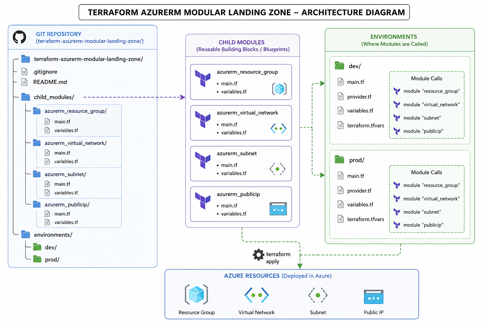
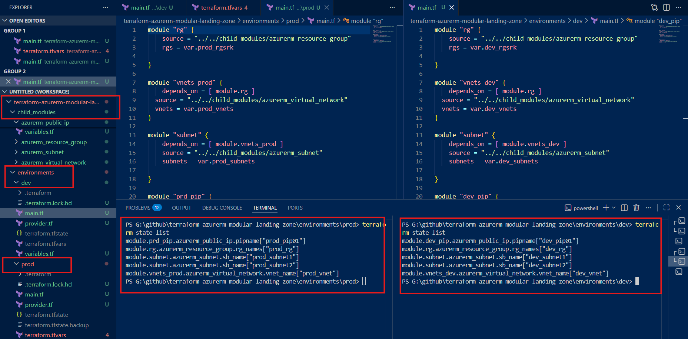
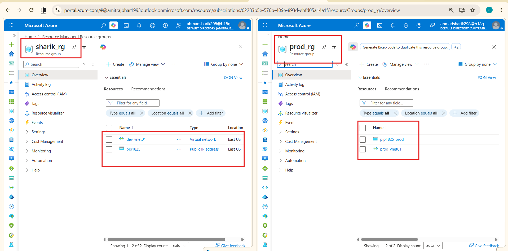

# 🚀 Enterprise Azure Landing Zone using Terraform Modules


---

A production-style Azure Infrastructure project built using Terraform Modular Architecture. This project demonstrates how enterprise organizations deploy reusable, scalable, and maintainable Infrastructure as Code (IaC) across multiple environments by separating reusable modules from environment-specific configurations.

---

# 📖 Project Overview

While learning Terraform, it's common to place everything inside a single main.tf file. Although this approach works for small labs, enterprise environments require reusable, standardized, and maintainable infrastructure.

To simulate a real-world Azure DevOps environment, I designed this project using `Terraform Modules`, allowing the same infrastructure to be deployed across multiple environments simply by changing input variables.

**This project provisions:**

* Azure Resource Groups
* Virtual Networks (VNets)
* Subnets
* Public IP Addresses

`using reusable Terraform modules.`

---

## 💡 Why Terraform Modules?

Terraform Modules act as reusable blueprints for infrastructure.

Instead of writing the same code repeatedly, infrastructure is written once inside a module and reused across different environments.

**Benefits**

* ✅ Reusable Infrastructure (DRY Principle)
* ✅ Cleaner and Organized Code
* ✅ Easy Environment Separation
* ✅ Consistent Resource Deployment
* ✅ Easy Maintenance
* ✅ Enterprise Standard Folder Structure

---

## 🏗️ Architecture



`(Your architecture image showing child_modules → Dev/Prod → Azure Resources)`

---

## 📂 Project Structure
```bash
terraform-azurerm-modular-landing-zone/
│
├── child_modules/
│   ├── azurerm_resource_group/
│   ├── azurerm_virtual_network/
│   ├── azurerm_subnet/
│   └── azurerm_public_ip/
│
├── environments/
│   ├── dev/
│   │   ├── main.tf
│   │   ├── provider.tf
│   │   ├── variables.tf
│   │   ├── terraform.tfvars
│   │   └── terraform.tfstate
│   │
│   └── prod/
│       ├── main.tf
│       ├── provider.tf
│       ├── variables.tf
│       ├── terraform.tfvars
│       └── terraform.tfstate
│
└── README.md
```

---

## 🔄 Deployment Flow
```bash
Reusable Terraform Modules
            │
            ▼
     Environment (Dev / Prod)
            │
            ▼
terraform init
            │
            ▼
terraform plan
            │
            ▼
terraform apply
            │
            ▼
Azure Infrastructure Created
```

---

## 🚀 Execution Results

### 1️⃣ Terraform Execution (VS Code)

The screenshot below demonstrates successful execution for both environments.

**Development Environment**

Successfully created:

* dev Resource Group
* dev Virtual Network
* dev Subnet 1
* dev Subnet 2
* dev Public IP

Terraform state confirms that all resources were deployed successfully.


**Production Environment**

Using the same reusable modules, Terraform successfully created:

* prod Resource Group
* prod Virtual Network
* prod Subnet 1
* prod Subnet 2
* prod Public IP

Each environment maintains its own independent Terraform state, ensuring complete isolation between Dev



---

## 2️⃣ Azure Portal Verification

Deployment was verified directly from the Azure Portal.

**Development Environment**

Resource Group:

`sharik_rg`

Resources deployed:

* dev_vnet01
* pip1825

---

**Production Environment**

Resource Group:

`prod_rg`

Resources deployed:

* prod_vnet01
* pip1825_prod

This confirms that the same Terraform modules successfully provisioned separate infrastructures for both environments while maintaining complete isolation.



---

### 🛠️ Technologies Used

* Terraform
* Microsoft Azure
* Azure Resource Manager (ARM)
* Infrastructure as Code (IaC)
* Terraform Modules
* Modular Architecture

---

### 📚 Key Learning Outcomes

Through this project, I gained hands-on experience with:

* Building reusable Terraform Modules
* Environment isolation using separate configurations
* Variable management with .tfvars
* Enterprise folder structure
* Terraform state management
* Azure infrastructure provisioning
* Infrastructure as Code best practices

---
